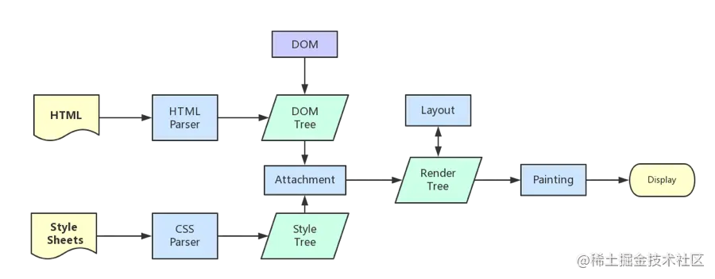

### 从URL输入到页面展现到底发生什么？
1. DNS 解析：将域名解析成 IP 地址
2. TCP 连接：TCP 三次握手
3. 发送 HTTP 请求
4. 服务器处理请求并返回 HTTP 报文
5. 浏览器解析渲染页面
6. 断开连接：TCP 四次挥手

#### 浏览器解析渲染页面过程
1. 解析HTML，生成DOM树，解析CSS，生成CSSOM树
2. 将DOM树和CSSOM树结合，生成渲染树(Render Tree)
3. Layout(回流)：根据生成的渲染树，进行回流(Layout)，得到节点的几何信息（位置，大小）
4. Painting(重绘)：根据渲染树以及回流得到的几何信息，得到节点的绝对像素
5. Display：将像素发送给GPU，展示在页面上。（这一步其实还有很多内容，比如会在GPU将多个合成层合并为同一个层，并展示在页面中。而css3硬件加速的原理则是新建合成层，这里我们不展开，之后有机会会写一篇博客）

https://juejin.cn/post/6844903779700047885



#### 重排(reflow)和重绘(repaint)
重排（回流）一定会触发重绘，而重绘不一定会回流。

**何时发生回流重绘**
- 添加或删除可见的DOM元素
- 元素的位置发生变化
- 元素的尺寸发生变化（包括外边距、内边框、边框大小、高度和宽度等）
- 内容发生变化，比如文本变化或图片被另一个不同尺寸的图片所替代
- 页面一开始渲染的时候（这肯定避免不了）
- 浏览器的窗口尺寸变化（因为回流是根据视口的大小来计算元素的位置和大小的）

**重排**：（Layout阶段）无论通过什么方式影响了元素的几何信息(元素在视口内的位置和尺寸大小)，浏览器需要重新计算元素在视口内的几何属性，这个过程叫做重排。

**重绘**：（Painting阶段）通过构造渲染树和重排（回流）阶段，我们知道了哪些节点是可见的，以及可见节点的样式和具体的几何信息（元素在视窗内的位置和尺寸大小），接下来就可以将渲染树的每个节点都转换为屏幕上的**实际像素**，这个阶段就叫重绘

**优化点**
1. 最小化重绘和重排：比如css样式集中改变
2. 需要对DOM对一系列修改的时候，先使元素脱离文档流，再对其进行修改，最后将元素带回到文档中
3. 使用 absolute 或 fixed 使元素脱离文档流：这在制作复杂的动画时对性能的影响比较明显
4. **开启 GPU 加速**（核心优化）：利用 css 属性 transform 、will-change 等，比如改变元素位置，我们使用 translate 会比使用绝对定位改变其 left 、top 等来的高效，因为它不会触发重排或重绘，transform 使浏览器为元素创建⼀个 GPU 图层，这使得动画元素在一个独立的层中进行渲染。当元素的内容没有发生改变，就没有必要进行重绘。
  - 触发 GPU 加速的 css 属性：**transform、opacity、filters、Will-change**
  - 为太多元素使用css3硬件加速，会导致内存占用较大，会有性能问题
  - 在GPU渲染字体会导致抗锯齿无效。这是因为GPU和CPU的算法不同。因此如果你不在动画结束的时候关闭硬件加速，会产生字体模糊。

**三种方式可以让DOM脱离文档流**
1. 隐藏元素，应用修改，重新显示。（display = 'none'）
```javascript
function appendDataToElement(appendToElement, data) {
    let li;
    for (let i = 0; i < data.length; i++) {
    	li = document.createElement('li');
        li.textContent = 'text';
        appendToElement.appendChild(li);
    }
}
const ul = document.getElementById('list');
ul.style.display = 'none';
appendDataToElement(ul, data);
ul.style.display = 'block';
```
2. 使用文档片段(document fragment)在当前DOM之外构建一个子树，再把它拷贝回文档
```javascript
const ul = document.getElementById('list');
const fragment = document.createDocumentFragment();
appendDataToElement(fragment, data);
ul.appendChild(fragment);
```
3. 将原始元素拷贝到一个脱离文档的节点中，修改节点后，再替换原始的元素
```javascript
const ul = document.getElementById('list');
const clone = ul.cloneNode(true);
appendDataToElement(clone, data);
ul.parentNode.replaceChild(clone, ul);
```
现代浏览器会使用队列来储存多次修改，一次执行，所以上3中优化方案已经过时了。

#### 盒模型
https://juejin.cn/post/6960866014384881671

CSS3 中的盒模型有以下两种：标准盒模型、IE（替代）盒模型。

两种盒子模型都是由 content + padding + border + margin 构成，其大小都是由 content + padding + border 决定的，但是盒子内容宽/高度（即 width/height）的计算范围根据盒模型的不同会有所不同：

**标准盒模型：只包含 content**（可明确地通过 width，min-width，max-width，height，min-height，max-height 控制）

**IE（替代）盒模型：content + padding + border**

可以通过 box-sizing 来改变元素的盒模型：

**box-sizing: content-box ：标准盒模型（默认值）**

**box-sizing: border-box ：IE（替代）盒模型**


#### BFC的理解
BFC（Block Formatting Contexts）即块级格式上下文，根据盒模型可知，每个元素都被定义为一个矩形盒子，然而盒子的布局会受到**尺寸，定位，盒子的子元素或兄弟元素，视口的尺寸**等因素决定，所以这里有一个浏览器计算的过程，计算的规则就是由一个叫做**视觉格式化模型**的东西所定义的，BFC 就是来自这个概念，它是 CSS 视觉渲染的一部分，**用于决定块级盒的布局及浮动相互影响范围的一个区域**。

以下元素会创建 BFC：
- 根元素（<html>）
- 浮动元素（float 不为 none）
- 绝对定位元素（position 为 absolute 或 fixed）
- 表格的标题和单元格（display 为 table-caption，table-cell）
- 匿名表格单元格元素（display 为 table 或 inline-table）
- 行内块元素（display 为 inline-block）
- overflow 的值不为 visible 的元素
- 弹性元素（display 为 flex 或 inline-flex 的元素的直接子元素）
- 网格元素（display 为 grid 或 inline-grid 的元素的直接子元素）

> 以上是 CSS2.1 规范定义的 BFC 触发方式，在最新的 CSS3 规范中，弹性元素和网格元素会创建 F(Flex)FC 和 G(Grid)FC。

**BFC 范围**

BFC 包含创建它的元素的所有子元素，但是不包括创建了新的 BFC 的子元素的内部元素。

简单来说，子元素如果又创建了一个新的 BFC，那么它里面的内容就不属于上一个 BFC 了，这体现了 BFC 隔离 的思想


**特性**

1. BFC 内部的块级盒会在垂直方向上一个接一个排列
2. 同一个 BFC 下的相邻块级元素可能发生外边距折叠，创建新的 BFC 可以避免的外边距折叠
3. 每个元素的外边距盒（margin box）的左边与包含块边框盒（border box）的左边相接触（从右向左的格式化，则相反），即使存在浮动也是如此
4. 浮动盒的区域不会和 BFC 重叠
5. 计算 BFC 的高度时，浮动元素也会参与计算

**自适应多栏布局**

利用 特性3 和 特性4，中间栏创建 BFC，左右栏宽度固定后浮动。由于盒子的 margin box 的左边和包含块 border box 的左边相接触，同时浮动盒的区域不会和 BFC 重叠，所以中间栏的宽度会自适应

**防止外边距折叠**

利用 特性2，创建新的 BFC ，让相邻的块级盒位于不同 BFC 下可以防止外边距折叠

**清除浮动**

利用 特性5，BFC 内部的浮动元素也会参与高度计算，可以清除 BFC 内部的浮动


### 实现两栏布局（左侧固定 + 右侧自适应布局）
1. 利用浮动，左边元素宽度固定 ，设置向左浮动。将右边元素的 margin-left 设为固定宽度 。注意，因为右边元素的 width 默认为 auto ，所以会自动撑满父元素
<html>
<head>
  <style>
  .outer1 {
    height: 100px;
  }
  .left1 {
    float: left;
    width: 200px;
    height: 100%;
    background: lightcoral;
  }
  .right1 {
    margin-left: 200px;
    height: 100%;
    background: lightseagreen;
  }
  </style>
</head>
<body>
  <div class="outer1">
    <div class="left1">左侧</div>
    <div class="right1">右侧</div>
  </div>
</body>
</html>

---

2. 同样利用浮动，左边元素宽度固定 ，设置向左浮动。右侧元素设置 overflow: auto; 这样右边就触发了 BFC ，BFC 的区域不会与浮动元素发生重叠，所以两侧就不会发生重叠。


<html>
<head>
  <style>
  .outer2 {
    height: 100px;
  }
  .left2 {
    float: left;
    width: 200px;
    height: 100%;
    background: lightcoral;
  }
  .right2 {
    overflow: auto;
    height: 100%;
    background: lightseagreen;
  }
  </style>
</head>
<body>
  <div class="outer2">
    <div class="left2">左侧</div>
    <div class="right2">右侧</div>
  </div>
</body>
</html>

---

3. 利用 flex 布局，左边元素固定宽度，右边的元素设置 flex: 1
<html>
<head>
  <style>
  .outer3 {
    display: flex;
    height: 100px;
  }
  .left3 {
    width: 200px;
    height: 100%;
    background: lightcoral;
  }
  .right3 {
    flex: 1;
    height: 100%;
    background: lightseagreen;
  }
  </style>
</head>
<body>
  <div class="outer3">
    <div class="left3">左侧</div>
    <div class="right3">右侧</div>
  </div>
</body>
</html>

---

4. 利用绝对定位，父级元素设为相对定位。左边元素 absolute  定位，宽度固定。右边元素的 margin-left  的值设为左边元素的宽度值

<html>
<head>
  <style>
  .outer {
    position: relative;
    height: 100px;
  }
  .left {
    position: absolute;
    width: 200px;
    height: 100%;
    background: lightcoral;
  }
  .right {
    margin-left: 200px;
    height: 100%;
    background: lightseagreen;
  }
  </style>
</head>
<body>
  <div class="outer4">
    <div class="left4">左侧</div>
    <div class="right4">右侧</div>
  </div>
</body>
</html>

---


### 实现圣杯布局和双飞翼布局（经典三分栏布局）

**圣杯布局和双飞翼布局的目的：**

- 三栏布局，中间一栏最先加载和渲染（内容最重要，这就是为什么还需要了解这种布局的原因）。
- 两侧内容固定，中间内容随着宽度自适应。
- 一般用于 PC 网页。

**圣杯布局和双飞翼布局的技术总结：**

- 使用 float  布局。
- 两侧使用 margin 负值，以便和中间内容横向重叠。
- 防止中间内容被两侧覆盖，圣杯布局用 padding ，双飞翼布局用 margin 。


**圣杯布局**

<html>
<head>
  <style>
  #container5 {
    padding-left: 200px;
    padding-right: 150px;
    overflow: auto;
  }
  #container5 p {
    float: left;
  }
  .center5 {
    width: 100%;
    background-color: lightcoral;
  }
  .left5 {
    width: 200px;
    position: relative;
    left: -200px;
    margin-left: -100%;
    background-color: lightcyan;
  }
  .right5 {
    width: 150px;
    margin-right: -150px;
    background-color: lightgreen;
  }
  .clearfix5:after {
    content: "";
    display: table;
    clear: both;
}
  </style>
</head>
<body>
<div id="container5" class="clearfix5">
  <p class="center5">我是中间</p>
  <p class="left5">我是左边</p>
  <p class="right5">我是右边</p>
</div>
</body>
</html>

---

**双飞翼布局**

<html>
<head>
  <style>
  .float6 {
    float: left;
  }
  #main6 {
    width: 100%;
    height: 200px;
    background-color: lightpink;
  }
  #main-wrap6 {
    margin: 0 190px 0 190px;
  }
  #left6 {
    width: 190px;
    height: 200px;
    background-color: lightsalmon;
    margin-left: -100%;
  }
  #right6 {
    width: 190px;
    height: 200px;
    background-color: lightskyblue;
    margin-left: -190px;
  }
  </style>
</head>
<body>
<div id="main6" class="float6">
  <div id="main-wrap6">main</div>
</div>
<div id="left6" class="float6">left</div>
<div id="right6" class="float6">right</div>
</body>
</html>

---


### 水平垂直居中多种实现方式

1. 利用绝对定位和 translate ，设置 left: 50%  和 top: 50%  现将子元素左上角移到父元素中心位置，然后再通过 translate  来调整子元素的中心点到父元素的中心。该方法可以**不定宽高**
```css
.father {
  position: relative;
}
.son {
  position: absolute;
  left: 50%;
  top: 50%;
  transform: translate(-50%, -50%);
}
```

2. 利用绝对定位，子元素所有方向都为 0 ，将 margin  设置为 auto ，由于宽高固定，对应方向实现平分，该方法必须**盒子有宽高**
```css
.father {
  position: relative;
}
.son {
  position: absolute;
  top: 0;
  left: 0;
  right: 0;
  bottom: 0;
  margin: auto;
  height: 100px;
  width: 100px;
}
```

3. 利用绝对定位，设置 left: 50% 和 top: 50% 现将子元素左上角移到父元素中心位置，然后再通过 margin-left  和 margin-top  以子元素自己的一半宽高进行负值赋值。该方法**必须定宽高**
```css
.father {
  position: relative;
}
.son {
  position: absolute;
  left: 50%;
  top: 50%;
  width: 200px;
  height: 200px;
  margin-left: -100px;
  margin-top: -100px;
}
```

4. 利用 flex ，最经典最方便的一种了，不用解释，定不定宽高无所谓的
```css
.father {
  display: flex;
  justify-content: center;
  align-items: center;
}
```

5. grid布局
```css
.box {
    width: 200px;
    height: 200px;
    border: 1px solid red;
    display: grid;
}
.children-box {
    width: 100px;
    height: 100px;
    background: yellow;
    margin: auto;
}
```

6. table-cell + vertical-align + inline-block/margin: auto
```css
.box {
    width: 200px;
    height: 200px;
    border: 1px solid red;
    display: table-cell;
    text-align: center;
    vertical-align: middle;
}
.children-box {
    width: 100px;
    height: 100px;
    background: yellow;
    display: inline-block; // 可以换成margin: auto;
}
```


### flex 布局
这里有个小问题，很多时候我们会用到 flex: 1 ，它具体包含了以下的意思：

- flex-grow: 1 ：该属性默认为 0 ，如果存在剩余空间，元素也不放大。设置为 1  代表会放大。
- flex-shrink: 1 ：该属性默认为 1 ，如果空间不足，元素缩小。
- flex-basis: 0% ：该属性定义在分配多余空间之前，元素占据的主轴空间。浏览器就是根据这个属性来计算是否有多余空间的。默认值为 auto ，即项目本身大小。设置为 0%  之后，-因为有 flex-grow  和 flex-shrink  的设置会自动放大或缩小。在做两栏布局时，如果右边的自适应元素 flex-basis  设为 auto  的话，其本身大小将会是 0 。​


### line-height 如何继承
- 父元素的 line-height 写了具体数值，比如 30px，则子元素 line-height 继承该值。
- 父元素的 line-height 写了比例，比如 1.5 或 2，则子元素 line-height 也是继承该比例。
- 父元素的 line-height 写了百分比，比如 200%，则子元素 line-height 继承的是父元素 font-size * 200% 计算出来的值。


### https和http
HTTPS 是支持加密和验证的 HTTP。两种协议的唯一区别是HTTPS 使用 TLS (SSL) 来加密普通的 HTTP 请求和响应，并对这些请求和响应进行数字签名。因此，HTTPS 比 HTTP 安全得多。使用 HTTP 的网站的 URL 中带有 http://，而使用 HTTPS 的网站则带有 https://。

正常请求看上去这样的：
GET /hello.txt HTTP/1.1
User-Agent: curl/7.63.0 libcurl/7.63.0 OpenSSL/1.1.l zlib/1.2.11
Host: www.example.com
Accept-Language: en

https类似这样的：
t8Fw6T8UV81pQfyhDkhebbz7+oiwldr1j2gHBB3L3RFTRsQCpaSnSBZ78Vme+DpDVJPvZdZUZHpzbbcqmSW1+3xXGsERHg9YDmpYk0VVDiRvw1H5miNieJeJ/FNUjgH0BmVRWII6+T4MnDwmCMZUI/orxP3HGwYCSIvyzS3MpmmSe4iaWKCOHQ==

TLS/SSl加密http请求
TLS 使用一种称为公钥加密的技术：密钥有两个，即公钥和私钥，其中公钥通过服务器的 SSL 证书与客户端设备共享。当客户端打开与服务器的连接时，这两个设备使用公钥和私钥商定新的密钥（称为会话密钥），以加密它们之间的后续通信。

然后，所有 HTTP 请求和响应都使用这些会话密钥进行加密），使任何截获通信的人都只能看到随机字符串，而不是明文。


**整体流程**

-- 证书验证阶段 --
1. 客户端请求服务器
2. 服务器响应时携带ca证书公钥A（服务端存有ca证书包含的公钥和私钥）

-- 非对称加密阶段 --
3. 客户端解析证书，验证合法性（若验证不合法，则提示https警告，由用户选择是否继续访问）
4. 客户端取出公钥A并生成随机码 KEY，使用公钥A加密随机码KEY
5. 客户端把加密后的随机码 KEY 发送给服务器，作为接下来对称加密的密钥
6. 服务端使用私钥B解密，获取真实的随机码 KEY
7. 服务端使用随机码 KEY 对传输数据进行对称加密，响应加密后的内容

-- 对称加密阶段 --
8. 客户端使用之前生成的随机码 KEY 解密数据
9. 后续请求都通过随机码 KEY 传输内容

**拓展**
客户端如何验证公钥的合法性？
1. 浏览器和操作系统内置了信任的根证书（CA组织下人格的根证书Root签发的）
2. 客户端如当发现当前证书的签发者是A，不是根证书，那就继续找签发者A的签发机构B，直到根证书匹配。最终信任当前证书。


### [TCP](https://juejin.cn/post/7028003193502040072)

TCP是面向连接的协议，它基于运输连接来传送TCP报文段，TCP运输连接的建立和释放，是每一次面向连接的通信中必不可少的过程。

**TCP连接的3个阶段**
1. 建立TCP连接，也就是通过三报文握手来建立TCP连接
2. 数据传送，也就是基于已建立的TCP连接进行可靠的数据传输
3. 释放连接，也就是在数据传输结束后，还要通过四报文挥手来释放TCP连接

TCP的连接建立主要是解决以下三个问题
1. 使TCP双方能够确知对方的存在
2. 使TCP双方能够协商一些参数（ 最大窗口值是否使用窗口扩大选项和时间戳选项，以及服务质量等）
3. 使TCP双方能够对运输实体资源（例如缓存大小连接表中的项目等）进行分配


### 浏览器进程与线程
浏览器是多线程的，实际是浏览器提供了执行异步任务的能力。
js是单线程的，指执行js代码的线程只有一个，是浏览器提供的js引擎线程（主线程）。
除了js引擎线程（主线程）之外，浏览器中还要定时器线程，http请求线程等。

当主线程中需要发送数据请求时，就会把这个任务交给http请求线程执行。当请求的数据返回之后，再将callback里要执行的js回调交给js引擎线程执行。
浏览器才是真正执行发送请求这个任务的角色，而 JS 只是负责执行最后的回调处理。
这里的异步不是js自身实现的，而是浏览器提供的能力

chrome架构：
- Renderer进程（内核）
  * GUI渲染线程
  * JS引擎线程
  * 事件触发线程
  * 定时器触发线程
  * 异步http请求线程
  这些线程为 JS 在浏览器中完成异步任务提供了基础
- 第三方插件进程
- cpu进程
- 浏览器进程

### js事件循环

**js任务**

同步任务：在主线程上排队执行的任务，只有一个任务执行完毕，才能执行下一个任务
异步任务：不进入主线程，而是放在任务队列中，若有多个异步任务则需要在任务队列中排队等待，任务队列类似于缓冲区，任务下一步会被移到执行栈然后主线程执行调用栈的任务

**执行栈和任务队列**

执行栈：
  - 执行栈使用到的是数据结构中的栈结构， 它是一个存储函数调用的栈结构，遵循**先进后出**的原则
  - 它主要负责跟踪所有要执行的代码

  （参数数组中的左进左出：A函数调用了B函数，A先进执行栈，B后进执行栈（unshift）。B先pop出并执行，再pop出A执行）
  
任务队列：
  - 用于保存异步任务，遵循**先进先出**原则
  - 主要负责将新的任务发送到任务队列进行处理
  - 根据任务种类不同，分为微任务队列和宏任务队列

**js执行过程：**
  - 先将将代码推入执行栈依次执行
  - 当遇到异步任务时，将异步任务放入任务队列中，先挂起等待同步任务执行完。再将异步任务交由浏览器的其他线程执行（如定时器触发线程执行**定时器任务**，异步http请求线程**执行http请求任务**等）
  - 当执行栈中所有同步代码执行完成之后，会不断读取任务队列，从中取出已完成的异步任务的**回调代码**放入执行栈中继续执行

**在事件驱动的模式下，至少包含了一个执行循环来检测任务队列中是否有新任务。通过不断循环，去取出异步任务的回调来执行，这个过程就是事件循环，每一次循环就是一个事件周期。**


### [宏任务和微任务](https://juejin.cn/post/6992167223523541023)
  根据任务种类不同，分为微任务队列和宏任务队列

  - 宏任务队列：script(整体代码)、setTimeout、setInterval、I/O、UI 交互事件、setImmediate(Node.js 环境)
  - 微任务队列：Promise.then、MutaionObserver、process.nextTick(Node.js 环境)

```javascript
console.log('同步代码1');

setTimeout(() => {
  console.log('setTimeout 5')
}, 0)

new Promise((resolve) => {
  console.log('同步代码2')
  setTimeout(() => {
    console.log('setTimeout 6')
  }, 0)
  resolve()
}).then(() => {
  console.log('promise.then 4')
})

console.log('同步代码3');
```

---

1. JavaScript 引擎首先从宏任务队列中取出第一个任务，执行
2. 第一个宏任务执行完毕后，再将微任务中的所有任务取出，按照顺序分别全部执行（**执行微任务过程中产生的新的微任务并不会推迟到下一个循环中执行，而是在当前的循环中继续执行**）


### js数据类型
Undefined、Null、Boolean、Number、String、Object、Symbol、BigInt

在操作系统中，内存被分为栈区和堆区：
- 栈：存储原始数据类型（Undefined、Null、Boolean、Number、String）。引用数据类型在栈中存储了指针，该指针指向堆中该实体的起始地址。栈中数据的存取方式为先进后出。
- 堆：存储引用数据类型（Object、Symbol、函数）。堆是一个优先队列，是按优先级来进行排序的，优先级可以按照大小来规定


### 原型链

- 什么是原型链？
```md
原型链是一种通过对象的原型属性来**实现对象之间继承关系的机制**。每个对象都有一个原型对象，它可以从原型对象继承属性和方法。
```

- 如何创建一个继承自另一个对象的对象？
```javascript
var parent = { name: "Parent" };
var child = Object.create(parent);
console.log(child.name); // "Parent"
```

- 如何判断一个对象是否是另一个对象的实例？
```javascript
function Person() {}
var p = new Person();
console.log(p instanceof Person); // true
```

- 如何判断一个属性是自身属性还是继承自原型？
可以使用hasOwnProperty()方法来判断一个属性是否是自身属性。例如：
```javascript
function Person() {}
Person.prototype.name = "Person";
var p = new Person();
console.log(p.hasOwnProperty("name")); // false
console.log(Person.prototype.hasOwnProperty("name")); // true
```

- 如何遍历一个对象的所有属性，包括继承自原型的属性？
可以使用for...in循环来遍历一个对象的所有可枚举属性，包括继承自原型的属性。需要注意的是，需要使用hasOwnProperty()方法来判断一个属性是否是自身属性。例如：
```javascript
function Person() {}
Person.prototype.name = "Person";
var p = new Person();
for (var prop in p) {
  if (p.hasOwnProperty(prop)) {
    console.log(prop + ": " + p[prop]);
  }
}
// 输出：name: undefined
```
(for...of不能用于遍历对象)


### 模块化

**传统模块化**

通过```<script src="./index.js" />```标签引用模块，产生问题：
- 污染全局作用域
- 命名冲突
- 无法管理模块之前的依赖


**AMD\CMD**

IIFE：立即执行函数

CMD和AMD都是JavaScript模块化规范，它们的主要区别在于模块定义和加载方式不同。具体来说：

CMD（Common Module Definition）采用**同步方式**加载模块，即只有当需要使用某个模块时才会加载该模块，因此CMD模块可以更精细地控制模块的加载顺序。常见的CMD库有SeaJS。常用于Node服务端。
AMD（Asynchronous Module Definition）采用异步方式加载模块，即定义模块时可以指定其依赖的模块，当所有依赖的模块加载完成后再执行当前模块。常见的AMD库有RequireJS。用于浏览器端。

CMD: 
- 一个文件就是一个模块
- 每个模块都有单独的作用域
- 通过module.exports、exports.xxx='mmm'导出成员
- 通过require函数载入模块


AMD:
Require.js实现了AMD规范

定义模块
```define('模块名', ['依赖项1', '依赖项2'], funsion(){ return {} // 导出当前声明的模块对象 })```

载入模块
```require(['模块1'], function(模块1) { 模块1.start() })``` 会创建script标签以导模块

定义、载入模块较为繁琐
大量的amd模块会导致引用大量的文件，性能受影响


**ES Module**
```<script type="module" />```
```<script nomodule />```
特性：
- 自动采用严格模式
- 每个esm都运行在单独的私有作用域中，防止了全局污染问题
- esm是通过cors的方式请求外部js模块，需要开发者处理跨域
- esm的script标签会自动延迟执行脚本

import\export:

导出的是对象的引用，运行时修改模块内的值，导入处会同步改动
导入的对象是只读的值，无法修改

```javascript
export const m = {
  xxx
};
export default xxx;
import { m } from './xxx.js'
import m from './xxx.js'
import * as m from './xxx.js'

if (true) {
  import('./module.js').then(res => console.log(res));
}
```
polyfill
babel-browser-build
browser-es-module-loader
将es6编译成es5适配ie

node中
es module 中可以导入commonjs模块
commonjs中不可以导入es module模块
commonjs始终只会导出一个默认成员
import不是解构

### babel

babel 就是一个 Javascript Transpiler（转译器）。

https://juejin.cn/post/7200366809409159205?searchId=202308131946334072D4319C221E6F5E2B#heading-6

通过插件编译转化代码至ES5。
1. 转译 esnext、typescript、flow 等到目标环境支持
2. 一些特定用途的代码转换
  - 比如函数插桩（函数中自动插入一些代码，例如埋点代码）、自动国际化等
3. 代码的静态分析
  - linter 工具就是分析 AST 的结构，对代码规范进行检查。
  - api 文档自动生成工具，可以提取源码中的注释，然后生成文档。
  - type checker 会根据从 AST 中提取的或者推导的类型信息，对 AST 进行类型是否一致的检查，从而减少运行时因类型导致的错误。
  - 压缩混淆工具，这个也是分析代码结构，进行删除死代码、变量名混淆、常量折叠等各种编译优化，生成体积更小、性能更优的代码。
  - js 解释器，除了对 AST 进行各种信息的提取和检查以外，我们还可以直接解释执行 AST。


**AST**

即 抽象语法树（abstract syntax tree）

通过不同的对象来保存不同的数据，并且按照依赖关系组织起来，这种数据结构就是抽象语法树（abstract syntax tree）。之所以叫抽象语法树是因为数据结构中省略掉了一些无具体意义的分隔符比如 ; { } 等。

#### babel api

babel 的编译流程分为三步：parse、transform、generate，每一步都暴露了一些 api ：
- parse 阶段有 @babel/parser，功能是把源码转成 AST
- transform 阶段有 @babel/traverse，可以遍历 AST，并调用 visitor 函数修改 AST，修改 AST 自然涉及到 AST 的判断、创建、修改等，这时候就需要 @babel/types 了，当需要批量创建 AST 的时候可以使用 @babel/template 来简化 AST 创建逻辑
- generate 阶段会把 AST 打印为目标代码字符串，同时生成 sourcemap，需要 @babel/generate 包

其他：
- 中途遇到错误想打印代码位置的时候，使用 @babel/code-frame 包
- babel 的整体功能通过 @babel/core 提供，基于上面的包完成 babel 整体的编译流程，并实现插件功能


### webpack 打包工具

**webpack**

https://juejin.cn/post/6943468761575849992

webpack是一款现代化的打包工具，它可以将多个模块打包成一个或多个bundle文件。webpack的打包过程可以简单概括为以下几个步骤：

读取入口文件(entry)：webpack会从指定的入口文件开始分析整个项目的依赖关系。

分析依赖：webpack会递归地分析入口文件引用的所有模块，并将它们组织成一个依赖关系图。

编译模块：webpack会将每个模块转换成浏览器可执行的代码，这个过程中可能会使用各种loader来处理不同类型的文件。

合并代码：webpack会将所有编译后的模块合并成一个或多个bundle文件，这个过程中可能会使用各种插件来优化代码。

输出文件(output)：webpack会将打包后的文件输出到指定的目录中，这个过程中可以配置各种输出选项。

总之，webpack通过分析依赖关系、编译模块、合并代码和输出文件等步骤，将多个模块打包成一个或多个bundle文件，从而实现了高效的模块化开发和部署。

**webpack模块加载原理**
webpack遵循es module标准的import声明
遵循commonjs标准的require函数
遵循amd标准的define函数和require函数
样式代码中的@import指令和url函数
html代码中的图片标签src属性


**loader 模块化核心** 专注实现模块化资源加载，通过不同的module处理不同的前端资源(css/js/html)
- 编译转换类（主要）
- 文件操作类
- 代码检查类

源码 => loader1 => loader1结果 => loader2 => => loader2结果 => loader3 => loader3结果 => ... => 最终结果（必须为js）

js驱动整个前端应用
```javascript
// webpack module loader
module.exports = {
  mode: 'none',
  entry: './src/index.js',
  output: {
    filename: 'bundle.js',
    path: './dist',
    publicPath: 'dist/'
  },
  module: {
    rules: [
      {
        test: ./js$/,
        use: {
          loader: 'babel-loader', // 加载器
          options: {
            presets: ['@bable/preset-env'], // es新特性编译插件集合
          }
        }
      },
      {
        test: /.css$/,
        use: [
          // use 数组内的组件从末位优先执行
          'style-loader',
          'css-loader', // 优先于style-loader执行。
        ]
      },
      {
        test: /.png$/,
        // use: [
        //   'file-loader'
        // ],
        use: {
          // file-loader使publicPath和hash文件名路径访问
          // url-loader 使png转为 data:image/png;xxxxxx 适用为体积小的资源
          loader: 'url-loader',
          options: {
            limit: 10 * 1024 // 小于10kb的转为 data url
          }
        }
      },
      {
        test: /.html$/,
        use: {
          loader: 'html-loader',
          options: {
            attrs: ['img:src', 'a:href'],
          }
        }
      }
    ]
  }
}
```

**plugin** 解决资源加载资源以外的自动化工作

插件机制
通过勾子机制实现
https://www.webpackjs.com/api/compiler-hooks/
```javascript
class MyPlugin {
  // webpack启动时自动启动
  apply(complier) {
    compiler.hooks.emit.tap('MyPlugin', compilation => {
      // compilation: 当前打包构建流程的上下文
      console.log(compilation);
      
      // do something...
    })
  }
}
```

**webpack watch**

webpack --watch 修改代码后自动编译

配合brower-sync监听dist目录自动刷新

磁盘写、读 效率较低

**webpack dev server**

安装webpack-dev-server依赖
执行webpack-dev-server启动应用即可自动编译 刷新页面。打包结果在内存中，没有保存在磁盘里
无效写读磁盘，效率较高

**hot module replace 热替换**

实时替换模块，页面不刷新，保留页面状态
已集成至webpack-dev-server --hot

**sourceMap**

https://juejin.cn/post/6943468761575849992

记录js压缩打包前的变量和打包后的变量关联关系，易于调试错误。

sourceMap是一项将编译、打包、压缩后的代码映射回源代码的技术，由于打包压缩后的代码并没有阅读性可言，一旦在开发中报错或者遇到问题，直接在混淆代码中debug问题会带来非常糟糕的体验，sourceMap可以帮助我们快速定位到源代码的位置，提高我们的开发效率。sourceMap其实并不是Webpack特有的功能，而是Webpack支持sourceMap，像JQuery也支持souceMap。


webpack.config 设置变量开启 devtool: 'source-map' // devtool有多种source map模式，分别对应打包速度、生产环境是否能用等等

**Tree-shaking**
Tree-shaking是一种用于优化JavaScript代码的技术，它可以通过静态分析代码中未被使用的部分并将其删除来减少打包后的文件大小。这样做可以减少浏览器需要下载和解析的代码量，从而提高页面加载速度和性能。

Tree-shaking通过ES6模块系统和静态分析来实现。当Webpack打包应用程序时，它会分析代码中导入和导出的模块，并且只包含被引用的模块和变量。未被引用的模块和变量将被删除，从而减少打包后的文件大小。

Tree-shaking只能删除未被使用的代码，而不能删除被间接使用的代码。因此，在使用Tree-shaking时，需要确保代码中只引用了需要使用的模块和变量。


### rollup 打包工具

https://juejin.cn/post/7145090564801691684?searchId=20230813193659B71B8D33A0944E71E150

rollup 是一个 JavaScript 模块打包器，可以将小块代码编译成大块复杂的代码，例如 library 或应用程序。
rollup的特色是 ES6 模块和代码 Tree-shaking，这些 webpack 同样支持，除此之外 webpack 还支持热模块替换、代码分割、静态资源导入等更多功能。
当开发应用时当然优先选择的是 webpack，但是若你项目只需要打包出一个简单的 bundle 包，并是基于 ES6 模块开发的，可以考虑使用 rollup。
**rollup 相比 webpack，它更少的功能和更简单的 api，是我们在打包类库时选择它的原因**


### Vite

一个基于浏览器原生 ES imports 的开发服务器。利用浏览器去解析 imports，在服务器端按需编译返回，完全跳过了打包这个概念，服务器随起随用。同时不仅有 Vue 文件支持，还搞定了热更新，而且热更新的速度不会随着模块增多而变慢。针对生产环境则可以把同一份代码用 rollup 打。解决改一行代码等半天热更新的问题。


### 箭头函数
箭头函数是ES6中新增的一种函数定义方式，相对于传统的函数定义方式，它具有以下优缺点：

优点：

更简洁的语法：箭头函数可以用更简洁的语法来定义函数，省略了function关键字和大括号，使代码更加简洁易读。
简化this指向：箭头函数的this指向是在定义时确定的，而不是在运行时确定的，这样可以避免this指向错误的问题。

缺点：

不能作为构造函数使用：箭头函数没有自己的this，也没有prototype属性，因此不能作为构造函数使用。
不能使用arguments对象：箭头函数没有自己的arguments对象，只能使用外部函数的arguments对象。


### this指向

在JavaScript中，this关键字用于指向当前执行环境的上下文对象。它的指向是在函数执行时动态确定的，具体取决于函数被调用时的方式。

下面是几种常见的this指向情况：

全局作用域：在全局作用域中，this指向全局对象（浏览器中为window对象）。

函数中的this：在函数中，this的指向取决于函数的调用方式。

作为普通函数调用时，this指向全局对象（非严格模式）或undefined（严格模式）。
作为对象的方法调用时，this指向该对象。
作为构造函数调用时，this指向新创建的实例对象。
使用apply()或call()方法调用时，this指向传入的第一个参数。
箭头函数中的this：在箭头函数中，this指向定义时所在的作用域中的this，而不是调用时的this。

```javascript
// 全局作用域中的this
console.log(this); // window

// 函数中的this
function foo() {
  console.log(this);
}
foo(); // window

const obj = {
  name: 'Alice',
  sayName() {
    console.log(this.name);
  }
};
obj.sayName(); // Alice

function Person(name) {
  this.name = name;
}
const p = new Person('Bob');
console.log(p.name); // Bob

function bar() {
  console.log(this.name);
}
const obj2 = { name: 'Charlie' };
bar.call(obj2); // Charlie

// 箭头函数中的this
const obj3 = {
  name: 'David',
  sayName: () => {
    console.log(this.name);
  }
};
obj3.sayName(); // undefined

const obj = {
  name: 'Alice',
  sayName: function() {
    const arrowFunc = () => {
      console.log(this.name);
    };
    arrowFunc();
  }
};
obj.sayName(); // Alice
```


### defer和async

都是异步加载，都不会阻塞HTML文档的解析和渲染

```html
例子：

script
<script src="script1.js"></script>
会阻碍 HTML 解析，只有下载好并执行完脚本才会继续解析 HTML。


defer
<script defer src="script1.js"></script>
完全不会阻碍 HTML 的解析，解析完成之后（DOMContentLoaded事件触发前）再按照顺序执行脚本。
执行顺序与它们在HTML文档中的顺序一致。


async
<script async src="script1.js"></script>
解析 HTML 过程中进行脚本的异步下载，下载成功立马执行，有可能会阻断 HTML 的解析
多个带有async属性的脚本的执行顺序是不确定的，取决于它们下载完成的顺序

```


### 严格模式

严格模式是ES5引入的，不属于ES6，ES6自动采用严格模式

- 禁止使用未声明的变量：在严格模式下，如果使用未声明的变量，会抛出一个ReferenceError错误。
- 禁止删除变量或函数：在严格模式下，如果使用delete操作符删除变量或函数，会抛出一个SyntaxError错误。
- 禁止使用八进制字面量：在严格模式下，如果使用八进制字面量，会抛出一个SyntaxError错误。
- 禁止使用with语句：在严格模式下，如果使用with语句，会抛出一个SyntaxError错误。
- 函数中的this值：在严格模式下，函数中的this值为undefined，而不是全局对象。
- 禁止在函数内部重新声明参数：在严格模式下，如果在函数内部重新声明参数，会抛出一个SyntaxError错误。
- 禁止使用eval和arguments作为变量名：在严格模式下，如果使用eval或arguments作为变量名，会抛出一个SyntaxError错误。
- 限制了eval的作用域：在严格模式下，eval函数中的代码不能访问调用它的函数的变量和函数。


### 常见兼容性问题

- 不同浏览器的标签默认的margin和padding不同； 通过设置css解决
```css
* { margin: 0; padding: 0; }
```
- 某些浏览器图片有默认间距，通过设置```font-size: 0```可解决
- 标签最低高度设置min-height不兼容问题；如果我们要设置一个标签的最小高度200px，需要进行的设置为：
```css
{ min-height:200px; height:auto !important; height:200px; overflow:visible };
```
- 图片加a标签在IE9中会有边框；```img{ border: none; }```可解决
- 在Chrome中字体不能小于10px；使用scale解决```p{font-size: 12px; transform: scale(0.8);}```
- 防抖和节流
```javascript

// 防抖
function debounce(fn: () => void, delay: number) {
    let timer: number;
    return function() {
        if (timer) clearTimeout(timer);
        let args = arguments;
        timer = setTimeout(() => {
            fn.apply(this, args);
        }, delay)
    }
}


// 节流
function throttle(fn: () => void, delay: number) {
    let timer: number;

    return function() {
        if (timer) return;
        let args = arguments;
        timer = setTimeout(() => {
            fn.apply(this, args);
        }, delay);
    }
}
```

### 高阶函数（HOF）

- 什么是高阶函数

可以接受函数做为参数或者函数作为返回值的函数。

### 高阶组件（HOC）

- 什么是高阶组件

可以接受组件做为参数或者函数作为返回值的函数。


高阶函数、组件常用于逻辑、组件复用

```jsx

function Auth(Comp) {
  return class extends React.Component {
    render() {
      return <Comp />
    }
  }
}

```

### React 事件

React根据w3c规范来定义自己的事件系统，其事件被称之为合成事件 (SyntheticEvent)。而其自定义事件系统的动机主要包含以下几个方面：

- 抹平不同浏览器之间的兼容性差异。最主要的动机
- 提供一个抽象的跨平台事件机制
- 所有事件的触发都代理到了 document，而不是 DOM 节点本身。document.addEventListener
- 可以干预事件的分发。React.16引入 **Fiber** 架构，可以通过干预事件的分发以优化用户的交互体验。

React 为了在触发事件时可以查找到对应的回调去执行，会把组件内的所有事件统一地存放到一个对象中（listenerBank）。

首先会根据事件类型分类存储，例如 click 事件相关的统一存储在一个对象中，回调函数的存储采用键值对（key/value）的方式存储在对象中，key 是组件的唯一标识 id，value 对应的就是事件的回调函数。

React事件分发也就是事件触发。React 的事件触发只会发生在 DOM 事件流的冒泡阶段，因为在 document 上注册时就默认是在冒泡阶段被触发执行。

1. 触发事件，开始 DOM 事件流，先后经过三个阶段：事件捕获阶段、处于目标阶段和事件冒泡阶段
2. 当事件冒泡到 document 时，触发统一的事件分发函数 ReactEventListener.dispatchEvent
3. 根据原生事件对象（nativeEvent）找到当前节点（即事件触发节点）对应的 ReactDOMComponent 对象
4. 事件的合成
    - 根据当前事件类型生成对应的合成对象
    - 封装原生事件对象和冒泡机制
    - 查找当前元素以及它所有父级
    - 在 listenerBank 中查找事件回调函数并合成到 events 中
5. 批量执行合成事件（events）内的回调函数
6. 如果没有阻止冒泡，会将继续进行 DOM 事件流的冒泡（从 document 到 window），否则结束事件触发

**React 合成事件和原生 DOM 事件的主要区别**
- React 组件上声明的事件没有绑定在 React 组件对应的原生 DOM 节点上
- React 利用事件委托机制，将几乎所有事件的触发代理（delegate）在 document 节点上，事件对象(event)是合成对象(SyntheticEvent)，不是原生事件对象，但通过 nativeEvent 属性访问原生事件对象。
- 由于 React 的事件委托机制，React 组件对应的原生 DOM 节点上的事件触发时机总是在 React 组件上的事件之前。

原生事件（阻止冒泡）会阻止合成事件的执行
合成事件（阻止冒泡）不会阻止原生事件的执行

### React 18
1. render方法废弃，使用createRoot

2. 批量setState：自动批量更新state，减少渲染次数。18之前，只在react事件中批量更新，18之后可以在Promise\setTimeout\dom原生事件等等批量setState。例子：
```javascript
setTimeout(() => {
  setCount(c => c + 1);
  setFlage(f => !f);
  // version < 18，渲染两次
  // version >= 18，渲染一次
}, 1000)

```

3. concurrent - 并发渲染

**version < 18**

线性渲染，无法中止
State update 1 => State update 2

**version >= 18**

渲染可被中断、继续、终止
渲染可在后台运行
渲染可以有优先级
这是一种新的底层机制，不是新功能

State update 1 => State update 2 => State update 1

State update 3 => State update 4 => State update 3

4. Transitions 

用于区别渲染优先级

应对同时有大量渲染的情况

```javascript
import { startTranstions, useTransition } from React;

// class 组件使用 startTranstions

// hook 使用useTranstion

/**
 * isPending 是否低优先级
 * startTransition 用于包裹需要降低优先级的function
 */
const [isPending, startTransition] = useTransition();

比如纯前端filter交互：输入框输入内容后，模糊搜索列表数据。
当列表数据过大时，会导致输入框渲染很慢，列表在更新里，输入的内容还没有出现，导致卡顿

const onChange = (e) => {
  setInput(e.target.value);
  startTransition(() => {
    setSearchParams(e.target.value);
  })
}

<div>
  <Input onChange={onChange} />
  <List filterParams={searchParams}>
</div>


```

5. Suspense

优化并发请求获取数据渲染页面的体验

fetch on render
fetch then render
fetch while render (Suspense)

**Suspense原理:**
```javascript
function Component() {
  if (data) {
    return <div>{data.message}</div>
  }
  throw promise
  // React will catch this, find the closest "Suspense" component
}

<Suspense fallback={<div>loading...</div>}>
  <Component />
</Suspense>
```

**并发获取数据并渲染的常见处理：**
```javascript
import React, { useEffect, useState, Suspense } from 'react'

const BaseInfo = () => {
  const [profile, setProfile] = useState(undefined);
  useEffect(() => {
    fetchProfile().then(res => setProfile(res?.data)) // 3秒返回
  }, [])
  return (
    <div>
      {profile?.name}
    </div>
  )
}
const Frinends = () => {
  const [list, setList] = useState([]);
  useEffect(() => {
    fetchFriends().then(res => setFriends(res?.data)) // 3秒返回
  }, [])
  return (
    <div>
      {list.map(it => <div>{it.name} - {it.id}</div>)}
    </div>
  )
}

const Page1 = () => {
  // fetchProfile 3秒 => fetchFriends 3秒
  // 需要6秒后才完成渲染 
  // fetch on render 
  return (
    <div>
      <BaseInfo />
      <Frinends />
    </div>
  )
}


const Page2 = () => {
  const [profile, setProfile] = useState(undefined);
  const [list, setList] = useState([]);
  // fetch then render 3秒
  // 只能等请求全部获取后才渲染
  useEffect(() => {
    Promise.all([
      new Promise(resolve => setTimeout(() => resolve({ name: 'xxx' }), 3000)), 
      new Promise(resolve => setTimeout(() => resolve([{ name: 'friends1' }, { name: 'friends2' }]), 3000))
    ]).then(([profile, friends]) => {
      setProfile(profile);
      setList(friends);
    })
  }, [])
  return (
    <div>
      <BaseInfo {...profile} />
      <Frinends {...list} />
    </div>
  )
}

// Suspense 处理
function wrapPromise(promise) {
  let status = 'pending';
  let result;
  let suspender = promise.then(
    (resolve) => {
      status = 'success';
      result = r;
    },
    (error) => {
      status = 'error';
      result = error;
    }
  );
  return {
    read() {
      if (status === 'pending') {
        throw suspender;
      } else if (status === 'error') {
        throw result;
      } else if (status === 'success') {
        return result
      }
    }
  }
}
const page3 = () => {
  // 哪个组个请求结束就立刻限显示对应组件
  return (
    <div>
      <Suspense fallback={<div>loading...</div>}>
        <BaseInfo />
      </Suspense>
      <Suspense fallback={<div>loading...</div>}>
        <Friends />
      </Suspense>
    </div>
  )
}


```