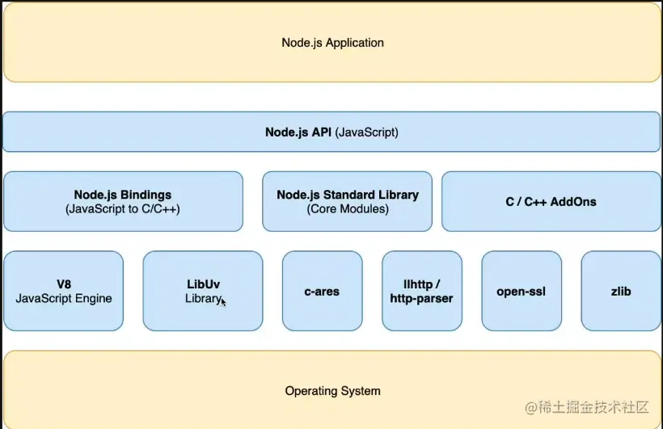
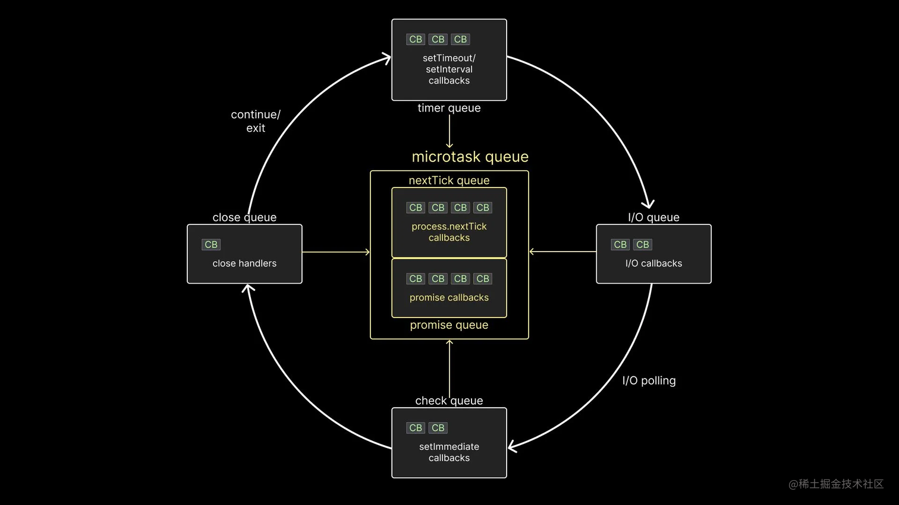

### 什么是Node.js？它是用于什么的？

https://juejin.cn/post/7220352362798825509?searchId=2023081811290726B833B80BEA5B84AF48

Node.js 是一个开源的、跨平台的 JavaScript 运行时环境，基于 Chrome V8 引擎构建而成。它允许开发人员使用 JavaScript 编写服务器端和命令行工具，实现高性能和可伸缩的网络应用程序。而且它是非阻塞的、事件驱动的 I/O 模型，有着自己独特的一套事件循环机制可以处理 JavaScript 中的异步。

运行在单线程上，为了处理异步，线程必须要有循环，不断地检查是否有未处理的事件，依次处理。
如果同时有多个客户端访问node，node仅仅有一个线程，不会给每一个客户都创建一个线程。
好处是操作系统完全没有创建线程和销毁线程的时间开销。

弊端：
* 无法利用多核CPU。
* 错误会引起整个应用无法继续调用异步I/O。
* 大量计算占用CPU导致无法继续调用异步I/O。

Node.js 的事件驱动和异步 I/O 功能正是基于 libuv 实现的。

### Node.js的事件循环是什么？它如何工作？

https://juejin.cn/post/7220352362798825509?searchId=2023081811290726B833B80BEA5B84AF48

是指用于处理异步操作和事件驱动的核心机制。Node.js 采用单线程的事件驱动模型，通过事件循环来处理和调度异步操作，以实现高效的非阻塞 I/O

只要 Node.js 应用程序在运行，事件循环就一直运行。每个循环中有六个不同的队列，每个队列都包含一个或多个需要最终在调用堆栈上执行的回调函数。

1. 首先，有一个计时器队列（timer queue。技术上叫最小堆（min-heap）），它保存与 setTimeout 和 setInterval 相关的回调函数。
2. 其次，有一个 I/O 队列（I/O queue），其中包含与所有异步方法相关的回调函数，例如 fs 和 http 模块中提供的相关方法。
3. 第三个是检查队列（check queue），它保存与 setImmediate 函数相关的回调函数，这是特定于Node 的功能。
4. 第四个是关闭队列（close queue），它保存与异步任务关闭事件相关联的回调函数。
5. 有两个不同队列组成微任务队列（microtask queue）。
    - nextTick 队列保存了与 process.nextTick 函数关联的回调函数。
    - Promise 队列则保存了JavaScript 中本地 Promise 相关联的回调函数。

#### 工作原理

和前端一样，编写的同步代码都比异步代码优先级更高。也就是在调用堆栈为空时，事件循环才会发挥作用。
1. 执行微任务队列（microtask queue）中的所有回调函数。首先是 nextTick 队列中的任务，然后是 Promise 队列中的任务。
2. 执行计时器队列（timer queue）内的所有回调函数。
3. 如果微任务队列中存在回调函数，则在计时器队列内每执行完一次回调函数之后执行微任务队列中的所有回调函数。首先是 nextTick 队列中的任务，然后是 Promise 队列中的任务。
4. 执行 I/O 队列（I/O queue）内的所有回调函数。
5. 如果微任务队列中存在回调函数，按照先 nextTick 队列后 Promise 队列的顺序依次执行微任务队列中的所有回调函数。
6. 执行检查队列（check queue）内的所有回调函数。
7. 如果微任务队列中存在回调函数，则在检查队列内每个回调之后执行微任务队列中的所有回调函数 。首先是 nextTick 队列中的任务，然后是 Promise 队列中的任务。
8. 执行关闭队列（close queue）内的所有回调函数。
9. 在同一循环的最后，再执行一次微任务队列。首先是 nextTick 队列中的任务，然后是 Promise 队列中的任务。

此时，如果还有更多的回调需要处理，那么事件循环再运行一次（译注：事件循环在程序运行期间一直在运行，在当前没有可供处理的任务情况下，会处于等待状态，一旦有新任务就会执行），并重复相同的步骤。另一方面，如果所有回调都已执行并且没有更多代码要处理（译注：也就是程序执行结束），则事件循环退出。
这就是 libuv 事件循环在 Node.js 中执行异步代码的作用。

> I/O
处理器访问任何寄存器和 Cache 等封装以外的数据资源都可以当成 I/O 操作，包括内存，磁盘，显卡等外部设备。在 Nodejs 中像开发者调用 fs 读取本地文件或网络请求等操作都属于I/O操作。（最普遍抽象 I/O 是文件操作和 TCP/UDP 网络操作）

### 什么是回调函数？为什么在Node.js中使用回调函数？

### 什么是异步编程？为什么在Node.js中使用异步编程？
### 什么是包管理器？Node.js中使用的包管理器是什么？
### 如何在Node.js中处理文件系统？
### Node.js如何处理错误？
### 如何在Node.js中进行调试和性能分析？
### 什么是流？如何在Node.js中使用流？
### 如何创建HTTP服务器和客户端？